# Nowcast/Forecast Workflow Diagrams

## Before vs After: Why Unify?

### BEFORE — Two Completely Separate Code Paths

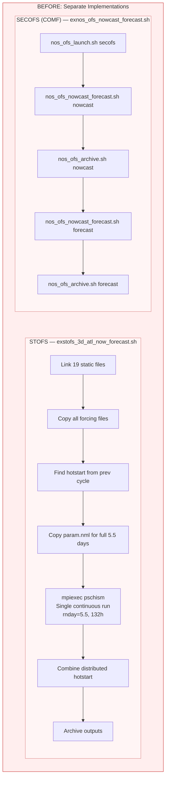

**Problems with the old approach:**
- COMF and STOFS have **zero shared code** for nowcast/forecast
- STOFS runs a **single monolithic 5.5-day simulation** — no separate nowcast/forecast phases
- Adding a new OFS means writing **a brand-new ex-script from scratch**
- Bug fixes in one framework **never propagate** to the other
- Different error handling, different logging, different conventions
- **563 lines** (STOFS) + **237 lines** (COMF) = **800 lines** of separate logic

---

### AFTER — Unified 4-Step Framework

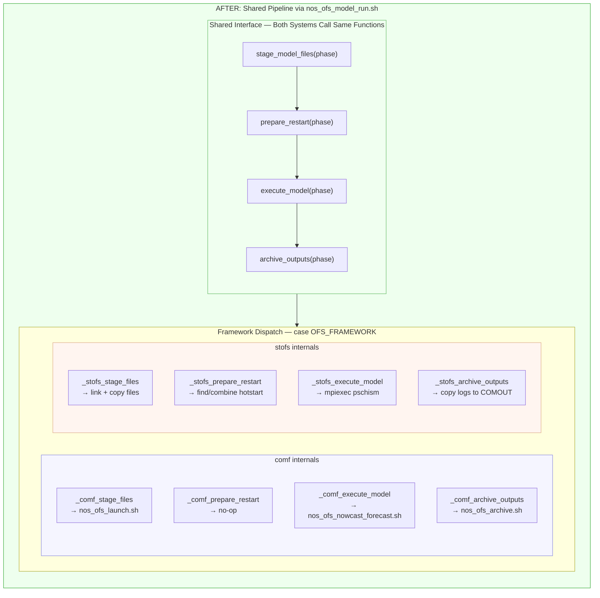

**Benefits of the unified approach:**
- Both systems use the **same 4 function calls** in the same order
- STOFS now runs **two separate phases** (nowcast + forecast) matching COMF
- Adding a new OFS = just implement `_newframework_*` internal functions
- **138 lines** (STOFS) + **181 lines** (COMF) = **319 lines** (down from 800)
- Shared error handling and logging patterns
- One place to add monitoring, metrics, or workflow improvements

---

### Code Reduction

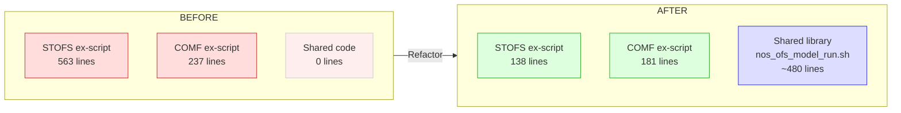

---

### Execution Pattern Comparison

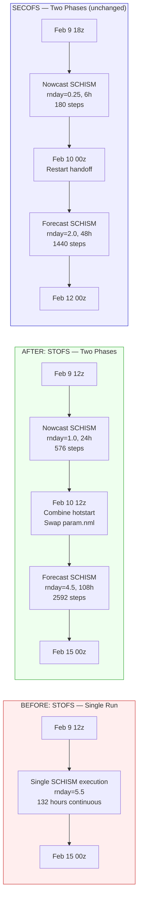

**Key change**: STOFS went from one monolithic 5.5-day run to two separate phases (24h + 108h), matching COMF's pattern. Same total simulation coverage, same physics — just split at the nowcast/forecast boundary.

---

### Adding a New OFS — Before vs After

The shared library dispatches by **framework** (comf or stofs), not by individual OFS.
All COMF systems (secofs, cbofs, dbofs, leofs, ngofs2, sfbofs, gomofs, ...) share `_comf_*` functions.
Adding a new OFS within an existing framework requires **no changes** to `nos_ofs_model_run.sh`.

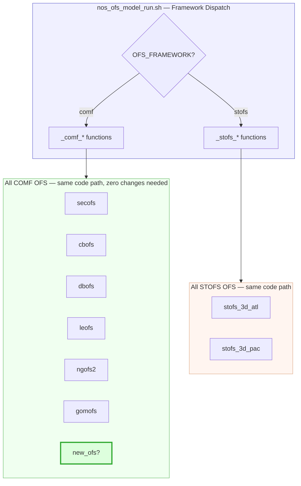

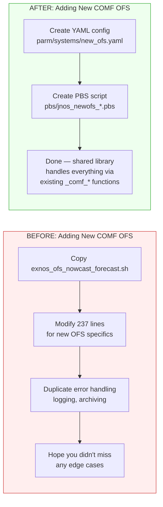

You only modify `nos_ofs_model_run.sh` if adding an entirely new **framework** (rare — currently just `comf` and `stofs`).

---

## Unified 4-Step Framework

Both SECOFS (COMF) and STOFS use the same interface from `nos_ofs_model_run.sh`.
The framework-specific internals differ, but the calling pattern is identical.

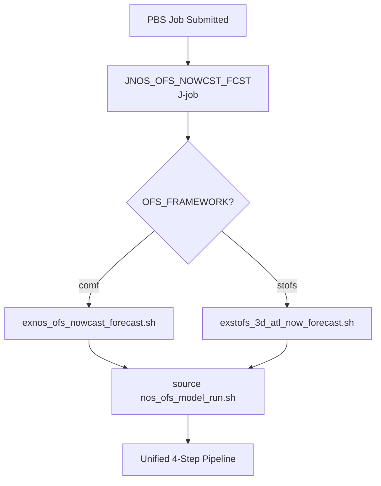

---

## SECOFS (COMF Framework) — 00z Cycle

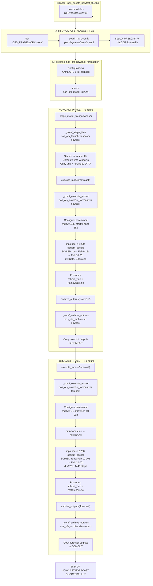

---

## STOFS-3D Atlantic (STOFS Framework) — 12z Cycle

```mermaid
flowchart TD
    subgraph PBS["PBS Job: jnos_stofs3datl_nowfcst_12.pbs"]
        A[Load modules<br/>OFS=stofs_3d_atl, cyc=12]
    end

    subgraph JJOB["J-job: JNOS_OFS_NOWCST_FCST"]
        B[Set OFS_FRAMEWORK=stofs]
        C[Load YAML config<br/>parm/systems/stofs_3d_atl.yaml]
        D[Compute time vars<br/>PDYHH_NCAST_BEGIN, PDYHH_FCAST_BEGIN]
    end

    subgraph EXSCRIPT["Ex-script: exstofs_3d_atl_now_forecast.sh"]
        E[source nos_ofs_model_run.sh]
    end

    subgraph NOWCAST["NOWCAST PHASE — 24 hours"]
        G["stage_model_files('nowcast')"]
        G1[_stofs_stage_files<br/>Link static files from FIXstofs3d]
        G2[Copy forcing from COMOUTrerun<br/>bctides, river, sflux, OBC, nudging]
        G3[Copy nowcast param.nml<br/>rnday=1.0, start=Feb 9 12z]

        H["prepare_restart('nowcast')"]
        H1[_stofs_prepare_restart<br/>Search 0-4 days back for<br/>hotstart.stofs3d.nc > 20GB]
        H2{Found?}
        H3[Use previous cycle hotstart]
        H4[Use coldstart file from fix/]

        I["execute_model('nowcast')"]
        I1[_stofs_execute_model<br/>Validate: param.nml, bctides.in,<br/>hgrid.gr3, vgrid.in]
        I2["mpiexec -n 4320 stofs_3d_atl_pschism 6<br/>SCHISM runs: Feb 9 12z → Feb 10 12z<br/>dt=150s, 576 steps"]
        I3[Produces:<br/>schout_*.nc<br/>hotstart_00000_576.nc distributed files]

        J["archive_outputs('nowcast')"]
        J1[Copy nowcast log to COMOUT]
    end

    subgraph FORECAST["FORECAST PHASE — 108 hours"]
        K["prepare_restart('forecast')"]
        K1[_stofs_prepare_restart<br/>exstofs_3d_atl_hot_restart_prep.sh]
        K2[Find distributed hotstart<br/>files at step 576]
        K3[stofs_3d_atl_combine_hotstart<br/>Merge into single hotstart.nc]
        K4[Copy forecast param.nml<br/>rnday=4.5, start=Feb 10 12z]
        K5["Set ihot=2 in param.nml<br/>Clean nowcast schout_*.nc<br/>Create mirror.out, flux.out, staout_*"]

        M["execute_model('forecast')"]
        M1[_stofs_execute_model<br/>Validate inputs]
        M2["mpiexec -n 4320 stofs_3d_atl_pschism 6<br/>SCHISM runs: Feb 10 12z → Feb 15 00z<br/>dt=150s, 2592 steps"]
        M3[Produces:<br/>schout_*.nc<br/>hotstart distributed files]

        N["archive_outputs('forecast')"]
        N1[Copy forecast log to COMOUT]
    end

    L["Finished SUCCESSFULLY"]

    PBS --> A --> JJOB
    B --> C --> D
    JJOB --> EXSCRIPT --> E

    E --> G --> G1 --> G2 --> G3
    G3 --> H --> H1 --> H2
    H2 -->|Yes| H3
    H2 -->|No| H4
    H3 --> I
    H4 --> I
    I --> I1 --> I2 --> I3
    I3 --> J --> J1

    J1 --> K --> K1 --> K2 --> K3 --> K4 --> K5
    K5 --> M --> M1 --> M2 --> M3
    M3 --> N --> N1

    N1 --> L
```

---

## Side-by-Side Comparison

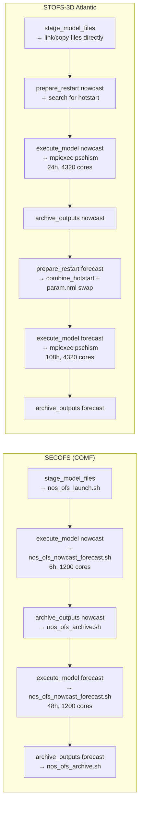

---

## Timeline Comparison

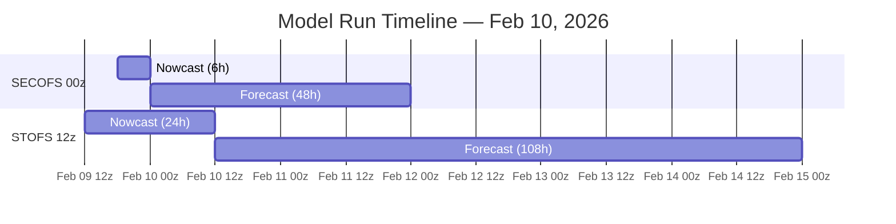

---

## Split-Job Mode for Production (ecFlow)

### Why Split?

The combined `JNOS_OFS_NOWCST_FCST` job runs both phases in a single PBS allocation.
This works for development but production ecFlow needs:

- **Independent retries** — if forecast fails, re-run only the forecast
- **Separate monitoring** — ecFlow tracks each task's status independently
- **Resource flexibility** — nowcast and forecast can have different walltimes
- **Dependency management** — post-processing triggers only after forecast completes

### Evolution of the Workflow

```mermaid
graph TD
    subgraph "Original STOFS (IT-STOFS)"
        P0[prep_nowcast] --> NF0["now_forecast<br/>(single continuous run)"]
        NF0 --> PO0A[post_1]
        PO0A --> PO0B[post_2]
        PO0B --> RS0[temp_salt_restart]
    end

    subgraph "Combined Mode (Dev)"
        P2[PREP] --> NF["NOWCAST → FORECAST<br/>(shared $DATA)"]
        NF --> PO2[POST]
    end

    subgraph "Split-Job Mode (Production)"
        P1[PREP] --> NC[NOWCAST]
        NC -->|"afterok dependency"| FC[FORECAST]
        FC --> PO1[POST]
        NC -.->|"hotstart via $COMOUT"| FC
    end

    style NF0 fill:#854d0e,color:#fff
    style NF fill:#2d6a4f,color:#fff
    style NC fill:#2d6a4f,color:#fff
    style FC fill:#2d6a4f,color:#fff
```

### Script Hierarchy

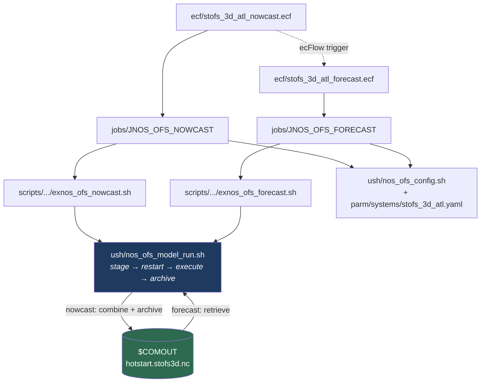

Each layer has a single responsibility:

| Layer | Files | Responsibility |
|-------|-------|----------------|
| **ecf/PBS** | `ecf/*.ecf` or `pbs/*.pbs` | Resource allocation, modules, env vars |
| **J-Job** | `jobs/JNOS_OFS_NOWCAST`, `JNOS_OFS_FORECAST` | Directory setup, YAML config, framework dispatch |
| **Ex-Script** | `scripts/.../exnos_ofs_{nowcast,forecast}.sh` | Orchestrate 4-step pipeline with error handling |
| **Shared Library** | `ush/nos_ofs_model_run.sh` | Model run logic (framework-agnostic) |

### Hotstart Handoff — The Key Challenge

In combined mode, both phases share `$DATA` — the forecast reads distributed
hotstart files directly from `$DATA/outputs/`. In split mode, each job has its
own `$DATA`, so the hotstart must pass through `$COMOUT`.

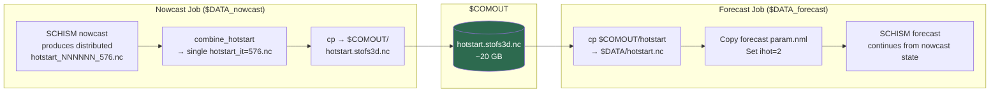

### Nowcast Job — Detailed Flow

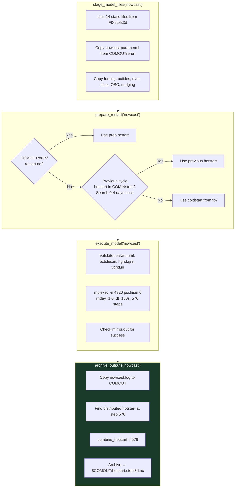

### Forecast Job — Detailed Flow

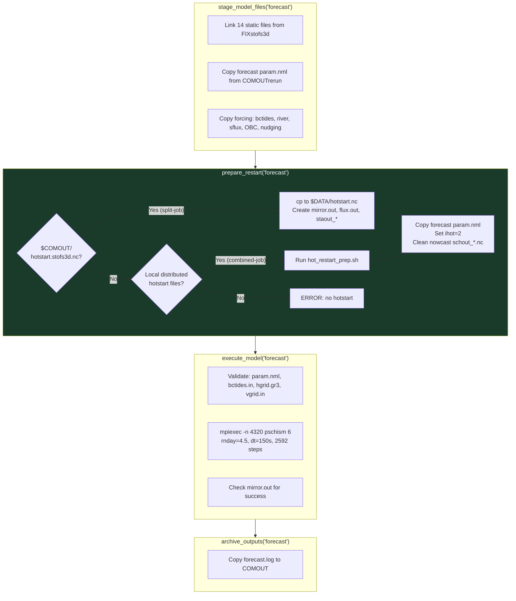

### Combined vs Split Mode Comparison

| Aspect | Combined (`JNOS_OFS_NOWCST_FCST`) | Split (`NOWCAST` + `FORECAST`) |
|--------|-----------------------------------|-------------------------------|
| `$DATA` | Shared between phases | Separate per job |
| Hotstart handoff | Local combine in forecast prep | Via `$COMOUT` (archived by nowcast) |
| COMF env vars | Set once by `launch.sh` | `launch.sh` re-runs in forecast job |
| Ex-script | `exstofs_3d_atl_now_forecast.sh` | `exnos_ofs_nowcast.sh` + `exnos_ofs_forecast.sh` |
| PBS submission | Single `qsub` | Two `qsub` with dependency |
| ecFlow compatible | No (single task) | Yes (separate tasks) |
| Retry granularity | Must retry both phases | Can retry forecast independently |
| Walltime | 04:00:00 total | Nowcast 01:30:00 + Forecast 04:00:00 |

Both modes use the **same** `nos_ofs_model_run.sh` functions — the functions
detect which mode they're in based on what files are available.

### Submission

**Dev testing (PBS):**
```bash
NCST_JOB=$(qsub jnos_stofs3datl_nowcast_12.pbs)
echo "Nowcast job: $NCST_JOB"
qsub -W depend=afterok:${NCST_JOB} jnos_stofs3datl_forecast_12.pbs
```

**Production (ecFlow):**
```
suite stofs_3d_atl
  family cycle_12
    task prep
    task nowcast
      trigger prep == complete
    task forecast
      trigger nowcast == complete
    task post
      trigger forecast == complete
  endfamily
endsuite
```
